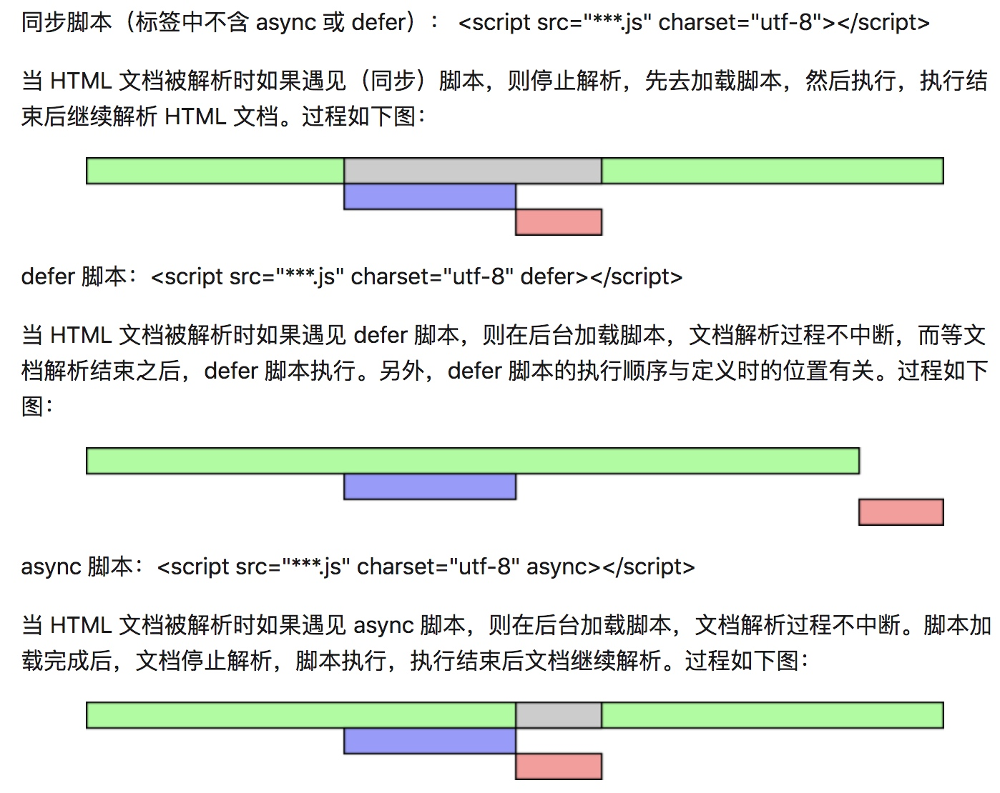
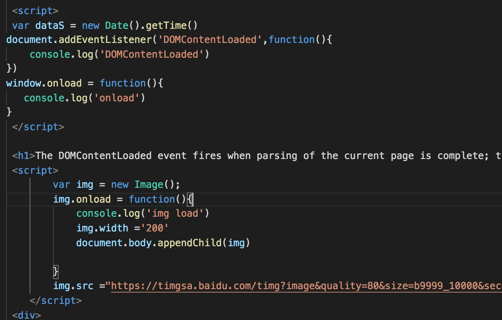

# DOMContentLoaded

当初始的 HTML 文档被完全加载和解析完成之后，DOMContentLoaded 事件被触发，而无需等待样式表、图像和子框架的完成加载。另一个不同的事件 load 应该仅用于检测一个完全加载的页面。

解释一下，当 HTML 文档解析完成就会触发 DOMContentLoaded，而所有资源加载完成之后，load 事件才会被触发。

输出优先级：

//DomContentLoaded
// img load
// onload

