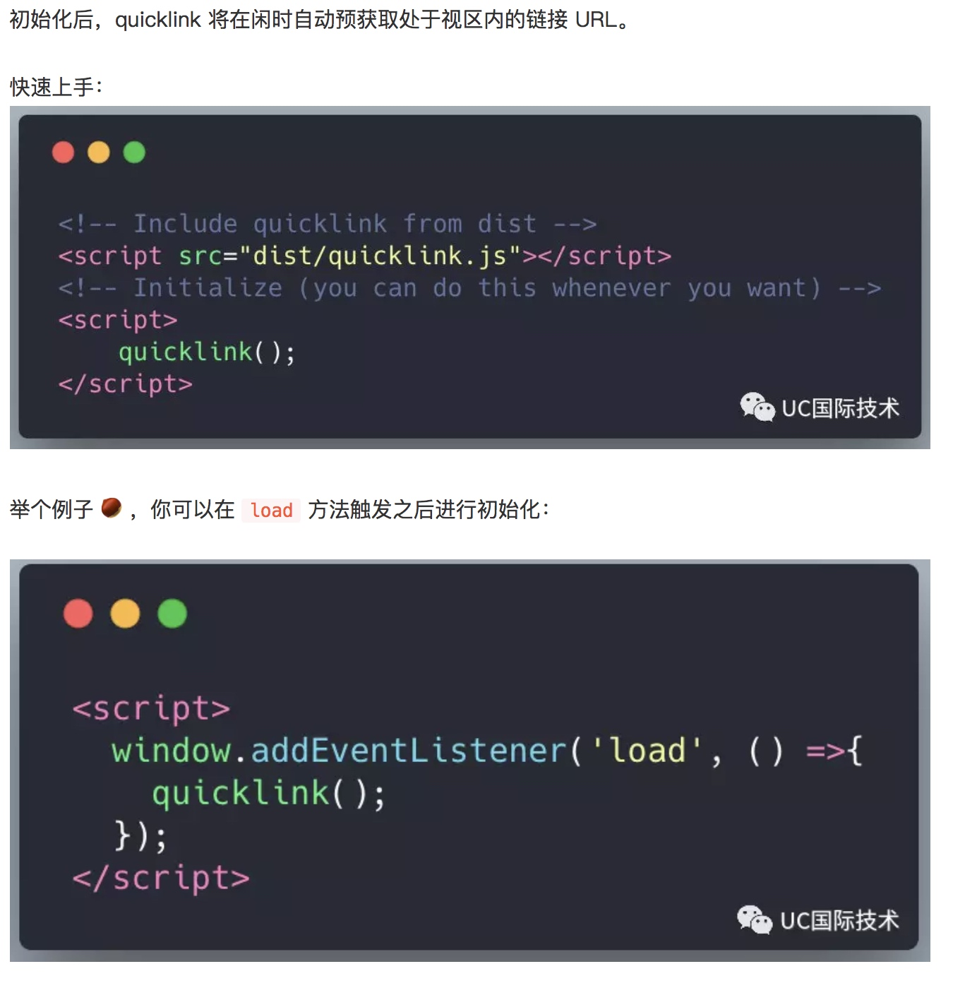
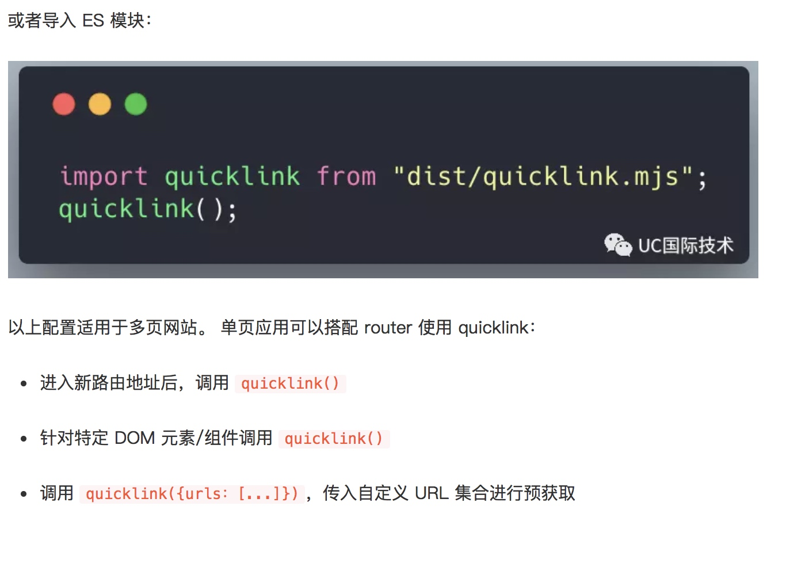
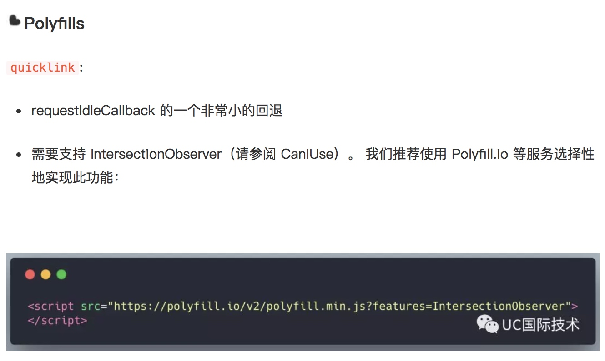
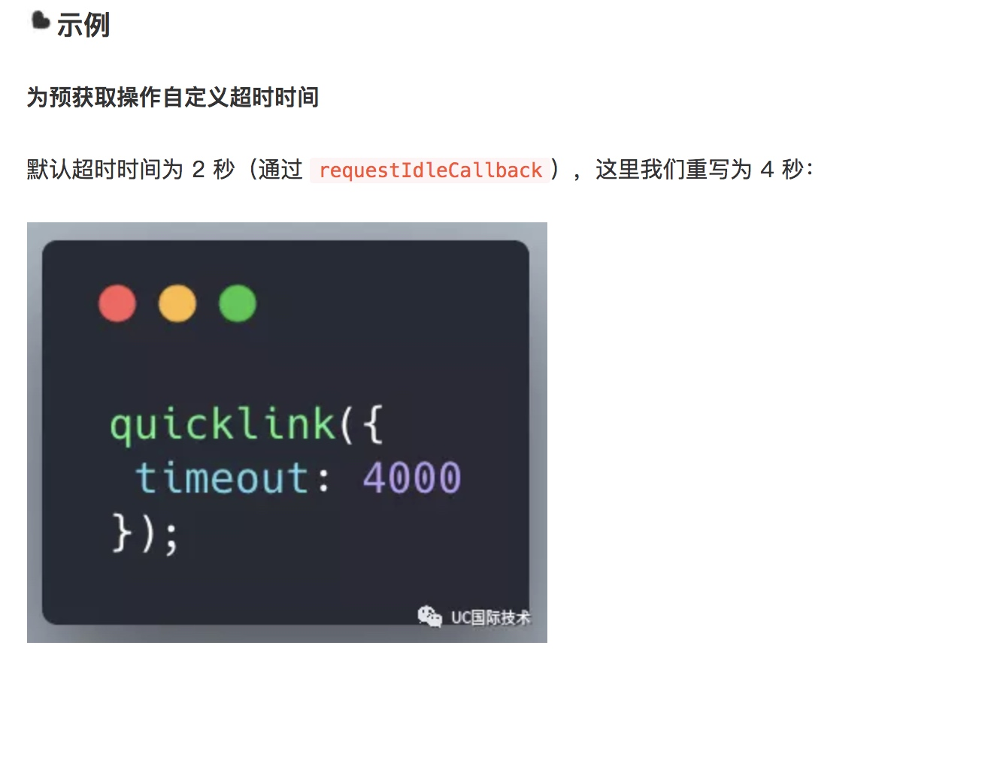
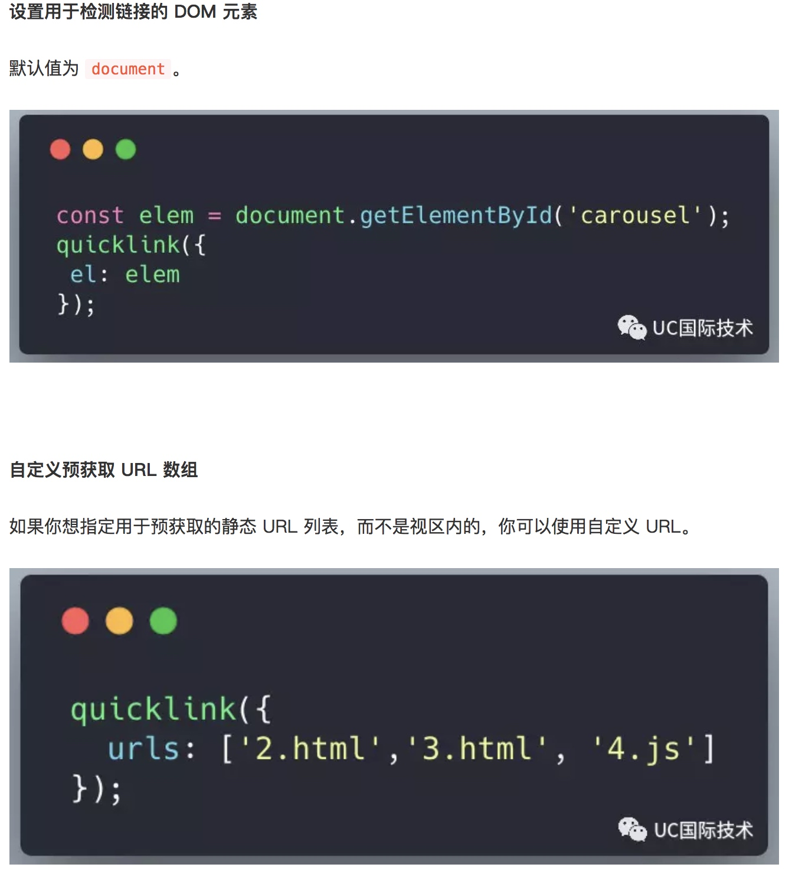
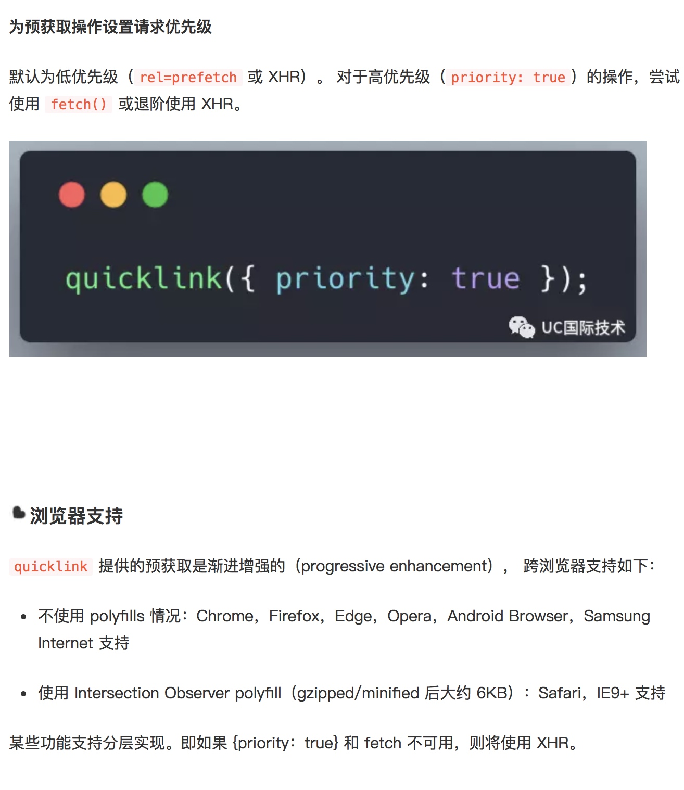
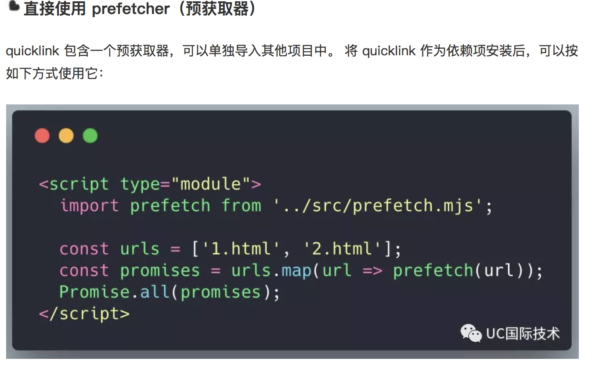

https://github.com/GoogleChromeLabs/quicklink

# 一句话介绍 quicklink

可以在空闲时间预获取页面可视区域（以下简称视区）内的链接，加快后续加载速度。

# 工作原理

* 检测视区中的链接（使用 Intersection Observer https://developer.mozilla.org/en-US/docs/Web/API/Intersection_Observer_API）
* 等待浏览器空闲（使用 requestIdleCallback https://developer.mozilla.org/en-US/docs/Web/API/Window/requestIdleCallback）
* 检查用户是否处于慢速连接（使用 navigator.connection.effectiveType）
* 或启用了省流模式（使用 navigator.connection.saveData）预获取视区内的 URL（使用<link rel=prefetch>或 XHR）。 可根据请求优先级进行控制（若支持 fetch() 可进行切换）。

# 开发原因

该项目旨在为网站提供一套解决方案，预获取处于用户视区中的链接，同时保持极小的体积（minified/gzipped 后 <1KB）。

# 安装方法

npm install --save quicklink

# API

quicklink 接受带有以下参数的 option 对象（可选）：

* el：指定需要预获取的 DOM 元素视区urls：预获取的静态 URL 数组（若此配置非空，则不会检测视区中 document 或 DOM 元素的链接）
* timeout：为 requestIdleCallback 设置的超时整数。 浏览器必须在此之前进行预获取（以毫秒为单位）， 默认取 2 秒。
* timeoutFn：指定超时处理函数。 默认为 requestIdleCallback。 也可以替换为 networkIdleCallback 等自定义函数（https://github.com/pastelsky/network-idle-callback，详见 demo）
* priority：布尔值，指定 fetch 的优先级。 默认为 false。 若配置为 true 将会尝试使用 fetch() API（而非 rel = prefetch）

    
待探索：

* 支持资源扩展名检测及使用 rel=preload 获取高优资源

* 使用 Priority Hints 进行重要性提示（https://github.com/WICG/priority-hints）

或者，请参见 
* Intersection Observer polyfill（https://github.com/w3c/IntersectionObserver/tree/master/polyfill）。
* CanIUse：https://caniuse.com/#feat=intersectionobserver

渐进增强：https://www.smashingmagazine.com/2009/04/progressive-enhancement-what-it-is-and-how-to-use-it/

