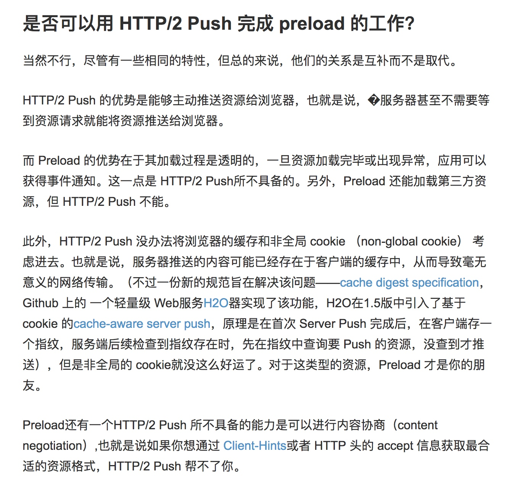

# Preload

Preload 作为一个新的web标准，旨在提高性能和为web开发人员提供更细粒度的加载控制。Preload使开发者能够自定义资源的加载逻辑，且无需忍受基于脚本的资源加载器带来的性能损失。

Preload是为处理当前页面所生

preload 不会阻塞 windows 的 onload 事件，除非，preload资源的请求刚好来自于会阻塞 window 加载的资源。

```
<link rel=“preload”>
<link rel="dns-prefetch" href="//g.alicdn.com" />
<link rel="prefetch" href="//g.alicdn.com" />
```


**prefetch**
的作用是告诉浏览器加载下一页面可能会用到的资源，注意，是下一页面，而不是当前页面。因此该方法的加载优先级非常低（自然，相比当前页面所需的资源，未来可能会用到的资源就没那么重要了），也就是说该方式的作用是加速下一个页面的加载速度。


### 资源的提前加载


preload 一个基本的用法是提前加载资源，尽管大多数基于标记语言的资源能被浏览器的预加载器（Preloader）尽早发现，但不是所有的资源都是基于标记语言的，比如一些隐藏在 CSS 和 Javascript 中的资源。当浏览器发现自己需要这些资源时已经为时已晚，所以大多数情况，这些资源的加载都会对页面渲染造成延迟。

> Preloader 简介
HTML 解析器在创建 DOM 时如果碰上同步脚本（synchronous script)，解析器会停止创建 DOM，转而去执行脚本。所以，如果资源的获取只发生在解析器创建 DOM时，同步脚本的介入将使网络处于空置状态，尤其是对外部脚本资源来说，当然，页面内的脚本有时也会导致延迟。

> 预加载器（Preloader）的出现就是为了优化这个过程，预加载器通过分析浏览器对 HTML 文档的早期解析结果（这一阶段叫做“令牌化（tokenization）”），找到可能包含资源的标签（tag），并将这些资源的 URL 收集起来。令牌化阶段的输出将会送到真正的 HTML 解析器手中，而收集起来的资源 URLs 会和资源类型一起被送到读取器（fetcher）手中，读取器会根据这些资源对页面加载速度的影响进行有次序地加载。


现在，有了 preload，你可以通过一段类似下面的代码对浏览器说，”嗨，浏览器！这个资源你后面会用到，现在就加载它吧。“


```
<link rel="preload" href="late_discovered_thing.js" as="script">
```


as 属性的作用是告诉浏览器被加载的是什么资源，可能的 as 值包括：


* "script"
* "style"
* "image"
* "media"
* "document"


### 对字体的提前加载

有了 preload 这个标准，简单的一段代码就能搞定字体的预加载。

```
<link rel="preload" href="font.woff2" as="font" type="font/woff2" crossorigin>
```

需要注意的一点是：crossorigin 属性是必须的，即便是字体资源在自家服务器上，因为用户代理必须采用匿名模式来获取字体资源。
type 属性可以确保浏览器只获取自己支持的资源。尽管Chrome 支持 WOFF2，也是目前唯一支持 preload 的浏览器，但未来或许会有更多的浏览器支持 preload，而这些浏览器支不支持 WOFF2 就不好说了。


### 动态加载，但不执行


另外一个有意思的场景也因为 preload 的出现变得可能——当你想加载某一资源但却不想执行它。比如说，你想在页面生命周期的某一时刻执行一段脚本，而你无法对这段脚本做任何修改，不可能为它创建一个所谓的 runNow（）函数。

在 preload 出现之前，你能做的很有限。如果你的方法是在希望脚本执行的位置插入脚本，由于脚本只有在加载完成以后才能被浏览器执行，也就是说你得等上一会儿。如果采用 XHR 提前加载脚本，浏览器会拒绝重用这段脚本，有些情况下，你可以使用 eval 函数来执行这段脚本，但该方法并不总是行得通，也不是完全没有副作用。

现在有了 preload，一切变得可能


```
var link = document.createElement("link");
link.href = "myscript.js";
link.rel = "preload";
link.as = "script";
document.head.appendChild(link)
```


上面这段代码可以让你预先加载脚本，下面这段代码可以让脚本执行

```
var script = document.createElement("script");
script.src = "myscript.js";
document.body.appendChild(script);
```


### 基于标记语言的异步加载

```
<link rel="preload" as="style" href="asyncstyle.css" onload="this.rel='stylesheet'">
```


preload 的 onload 事件可以在资源加载完成后修改 rel 属性，从而实现非常酷的异步资源加载。
脚本也可以采用这种方法实现异步加载

难道我们不是已经有了<script async>?  <scirpt async>虽好，但却会阻塞 window 的 onload 事件。某些情况下，你可能希望这样，但总有一些情况你不希望阻塞 window 的 onload 。

举个例子，你想尽可能快的加载一段统计页面访问量的代码，但又不愿意这段代码的加载给页面渲染造成延迟从而影响用户体验，关键是，你不想延迟 window 的 onload 事件。
有了preload， 分分钟搞定。


```
<link rel="preload" as="script" href="async_script.js"
      onload="var script = document.createElement('script'); script.src = this.href; document.body.appendChild(script);">

```


### 检查是否支持preload

```
var DOMTokenListSupports = function(tokenList, token) {
  if (!tokenList || !tokenList.supports) {
    return;
  }
  try {
    return tokenList.supports(token);
  } catch (e) {
    if (e instanceof TypeError) {
      console.log("The DOMTokenList doesn't have a supported tokens list");
    } else {
      console.error("That shouldn't have happened");
    }
  }
};

var linkSupportsPreload = DOMTokenListSupports(document.createElement("link").relList, "preload");
if (!linkSupportsPreload) {
  // Dynamically load the things that relied on preload.
}

```




