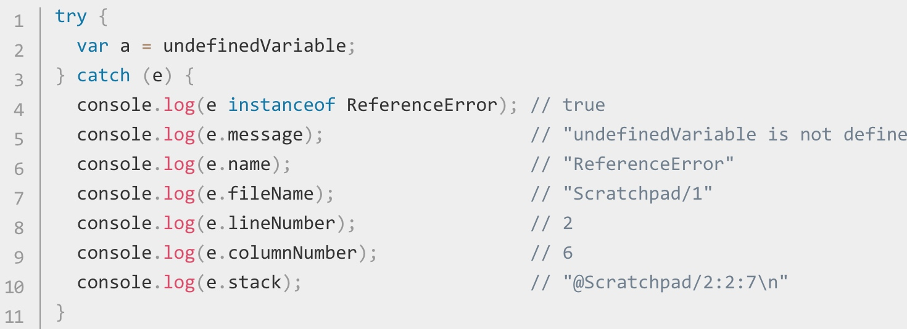

# Error的类型

**ReferenceError**
（引用错误） 对象代表当一个不存在的变量被引用时发生的错误。

**TypeError**
（类型错误） 对象用来表示值的类型非预期类型时发生的错误。

**EvalError**
本对象代表了一个关于 eval 函数的错误.此异常不再会被JavaScript抛出，但是EvalError对象仍然保持兼容性.

**InternalError**
对象表示出现在JavaScript引擎内部的错误。 例如： "InternalError: too much recursion"（内部错误：递归过深）。

**SyntaxError** 
对象代表尝试解析语法上不合法的代码的错误。

**URIError**
对象用来表示以一种错误的方式使用全局URI处理函数而产生的错误。

**RangeError**
对象标明一个错误，当一个值不在其所允许的范围或者集合中。

