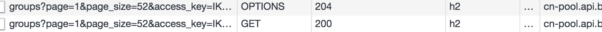
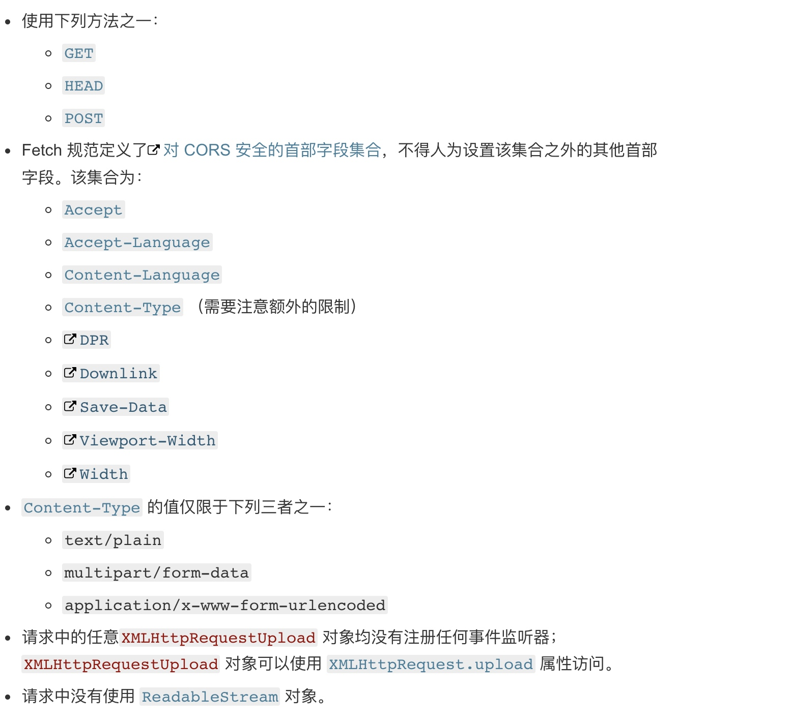

# 跨域（cross-origin）请求时发生两次，一次Method是options ,一次是正常的请求


https://developer.mozilla.org/zh-CN/docs/Web/HTTP/Access_control_CORS


什么情况会跨域？

协议、端口、域名不同，就会跨域

如下图所示


### 在页面中如何获取协议、端口、域名

```
协议：document.protocol
端口：document.port
域名：document.domain (如果已经修改过document.domain，则返回修改后)

```

### 跨源网路访问


> ##### X-Frame-Options：
> DENY
> 表示该页面不允许在 frame 中展示，即便是在相同域名的页面中嵌套也不允许。
> SAMEORIGIN
> 表示该页面可以在相同域名页面的 frame 中展示。
> ALLOW-FROM uri
> 表示该页面可以在指定来源的 frame 中展示。


#### cors预请求

跨域资源共享(CORS) 是一种机制，它使用额外的 HTTP 头来告诉浏览器  让运行在一个 origin (domain) 上的Web应用被准许访问来自不同源服务器上的指定的资源。当一个资源从与该资源本身所在的服务器不同的域或端口请求一个资源时，资源会发起一个跨域 HTTP 请求。


第一请求method为options，为预请求



### CORS请求分成两类：简单请求（simple request）和非简单请求（not-so-simple request）。

满足一下条件为简单请求




### 简单请求

对于简单请求，浏览器直接发出CORS请求。具体来说，就是在头信息之中，增加一个Origin字段。

下面是一个例子，浏览器发现这次跨源AJAX请求是简单请求，就自动在头信息之中，添加一个Origin字段。

```
GET /cors HTTP/1.1
Origin: http://api.bob.com
Host: api.alice.com
Accept-Language: en-US
Connection: keep-alive
User-Agent: Mozilla/5.0...
```


### 非简单请求

非简单请求是那种对服务器有特殊要求的请求，比如请求方法是PUT或DELETE，或者Content-Type字段的类型是application/json。

非简单请求的CORS请求，会在正式通信之前，增加一次HTTP查询请求，称为"预检"请求（preflight）。

浏览器先询问服务器，当前网页所在的域名是否在服务器的许可名单之中，以及可以使用哪些HTTP动词和头信息字段。只有得到肯定答复，浏览器才会发出正式的XMLHttpRequest请求，否则就报错。

下面是一段浏览器的JavaScript脚本。

```
var url = 'http://api.alice.com/cors';
var xhr = new XMLHttpRequest();
xhr.open('PUT', url, true);
xhr.setRequestHeader('X-Custom-Header', 'value');
xhr.send();
```

上面代码中，HTTP请求的方法是PUT，并且发送一个自定义头信息X-Custom-Header。

浏览器发现，这是一个非简单请求，就自动发出一个"预检"请求，要求服务器确认可以这样请求。下面是这个"预检"请求的HTTP头信息。


```
OPTIONS /cors HTTP/1.1
Origin: http://api.bob.com
Access-Control-Request-Method: PUT
Access-Control-Request-Headers: X-Custom-Header
Host: api.alice.com
Accept-Language: en-US
Connection: keep-alive
User-Agent: Mozilla/5.0...
```


"预检"请求用的请求方法是OPTIONS，表示这个请求是用来询问的。头信息里面，关键字段是Origin，表示请求来自哪个源。

除了Origin字段，"预检"请求的头信息包括两个特殊字段。

（1）Access-Control-Request-Method

该字段是必须的，用来列出浏览器的CORS请求会用到哪些HTTP方法，上例是PUT。

（2）Access-Control-Request-Headers

该字段是一个逗号分隔的字符串，指定浏览器CORS请求会额外发送的头信息字段，上例是X-Custom-Header。


服务器收到"预检"请求以后，检查了Origin、Access-Control-Request-Method和Access-Control-Request-Headers字段以后，确认允许跨源请求，就可以做出回应。


```
HTTP/1.1 200 OK
Date: Mon, 01 Dec 2008 01:15:39 GMT
Server: Apache/2.0.61 (Unix)
Access-Control-Allow-Origin: http://api.bob.com
Access-Control-Allow-Methods: GET, POST, PUT
Access-Control-Allow-Headers: X-Custom-Header
Content-Type: text/html; charset=utf-8
Content-Encoding: gzip
Content-Length: 0
Keep-Alive: timeout=2, max=100
Connection: Keep-Alive
Content-Type: text/plain
```


上面的HTTP回应中，关键的是Access-Control-Allow-Origin字段，表示http://api.bob.com可以请求数据。该字段也可以设为星号，表示同意任意跨源请求。

```
Access-Control-Allow-Origin: *
```


如果浏览器否定了"预检"请求，会返回一个正常的HTTP回应，但是没有任何CORS相关的头信息字段。这时，浏览器就会认定，服务器不同意预检请求，因此触发一个错误，被XMLHttpRequest对象的onerror回调函数捕获。控制台会打印出如下的报错信息


```
XMLHttpRequest cannot load http://api.alice.com.
Origin http://api.bob.com is not allowed by Access-Control-Allow-Origin.
```

服务器回应的其他CORS相关字段如下。


```
Access-Control-Allow-Methods: GET, POST, PUT
Access-Control-Allow-Headers: X-Custom-Header
Access-Control-Allow-Credentials: true
Access-Control-Max-Age: 1728000
```


（1）Access-Control-Allow-Methods

该字段必需，它的值是逗号分隔的一个字符串，表明服务器支持的所有跨域请求的方法。注意，返回的是所有支持的方法，而不单是浏览器请求的那个方法。这是为了避免多次"预检"请求。

（2）Access-Control-Allow-Headers

如果浏览器请求包括Access-Control-Request-Headers字段，则Access-Control-Allow-Headers字段是必需的。它也是一个逗号分隔的字符串，表明服务器支持的所有头信息字段，不限于浏览器在"预检"中请求的字段。

（3）Access-Control-Allow-Credentials

该字段与简单请求时的含义相同。

（4）Access-Control-Max-Age

该字段可选，用来指定本次预检请求的有效期，单位为秒。上面结果中，有效期是20天（1728000秒），即允许缓存该条回应1728000秒（即20天），在此期间，不用发出另一条预检请求。


一旦服务器通过了"预检"请求，以后每次浏览器正常的CORS请求，就都跟简单请求一样，会有一个Origin头信息字段。服务器的回应，也都会有一个Access-Control-Allow-Origin头信息字段。

下面是"预检"请求之后，浏览器的正常CORS请求。


```

PUT /cors HTTP/1.1
Origin: http://api.bob.com
Host: api.alice.com
X-Custom-Header: value
Accept-Language: en-US
Connection: keep-alive
User-Agent: Mozilla/5.0...
```


上面头信息的Origin字段是浏览器自动添加的。

下面是服务器正常的回应。

```
Access-Control-Allow-Origin: http://api.bob.com
Content-Type: text/html; charset=utf-8
```

上面头信息中，Access-Control-Allow-Origin字段是每次回应都必定包含的。


