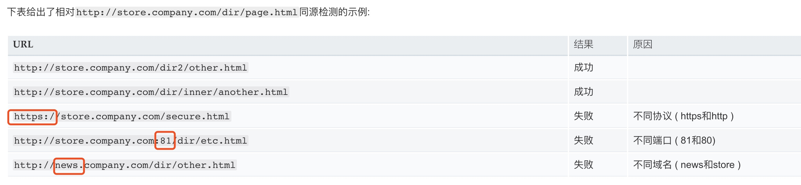
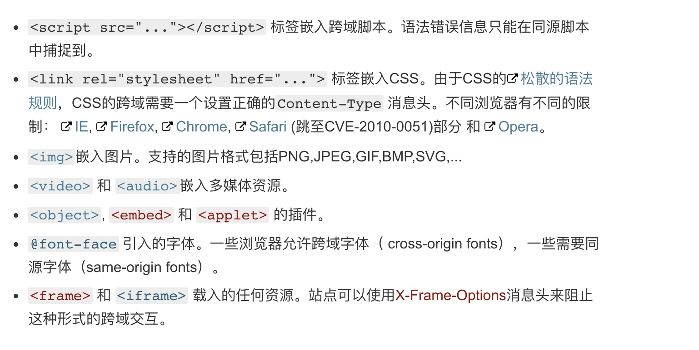

# 跨域（cross-origin）请求时发生两次，一次Method是options ,一次是正常的请求


https://developer.mozilla.org/zh-CN/docs/Web/HTTP/Access_control_CORS


什么情况会跨域？

协议、端口、域名不同，就会跨域

如下图所示



### 在页面中如何获取协议、端口、域名

```
协议：document.protocol
端口：document.port
域名：document.domain (如果已经修改过document.domain，则返回修改后)

```

### 跨源网路访问



> ##### X-Frame-Options：
> DENY
> 表示该页面不允许在 frame 中展示，即便是在相同域名的页面中嵌套也不允许。
> SAMEORIGIN
> 表示该页面可以在相同域名页面的 frame 中展示。
> ALLOW-FROM uri
> 表示该页面可以在指定来源的 frame 中展示。


#### cors预请求

跨域资源共享(CORS) 是一种机制，它使用额外的 HTTP 头来告诉浏览器  让运行在一个 origin (domain) 上的Web应用被准许访问来自不同源服务器上的指定的资源。当一个资源从与该资源本身所在的服务器不同的域或端口请求一个资源时，资源会发起一个跨域 HTTP 请求。

